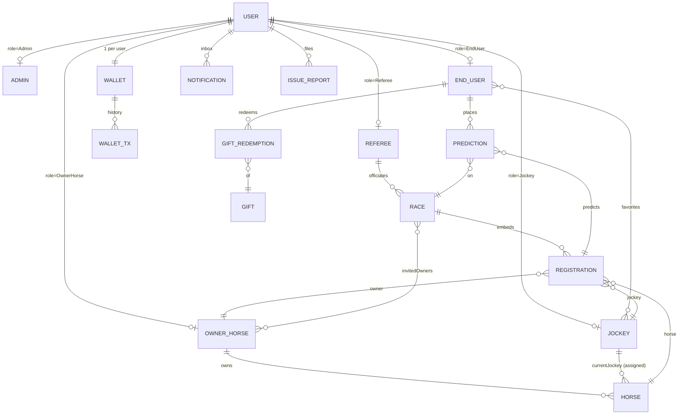
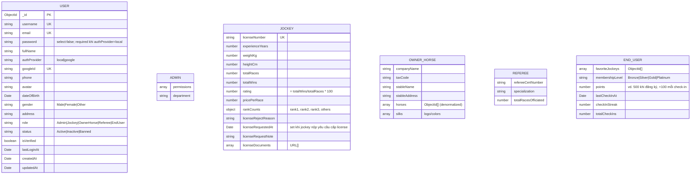
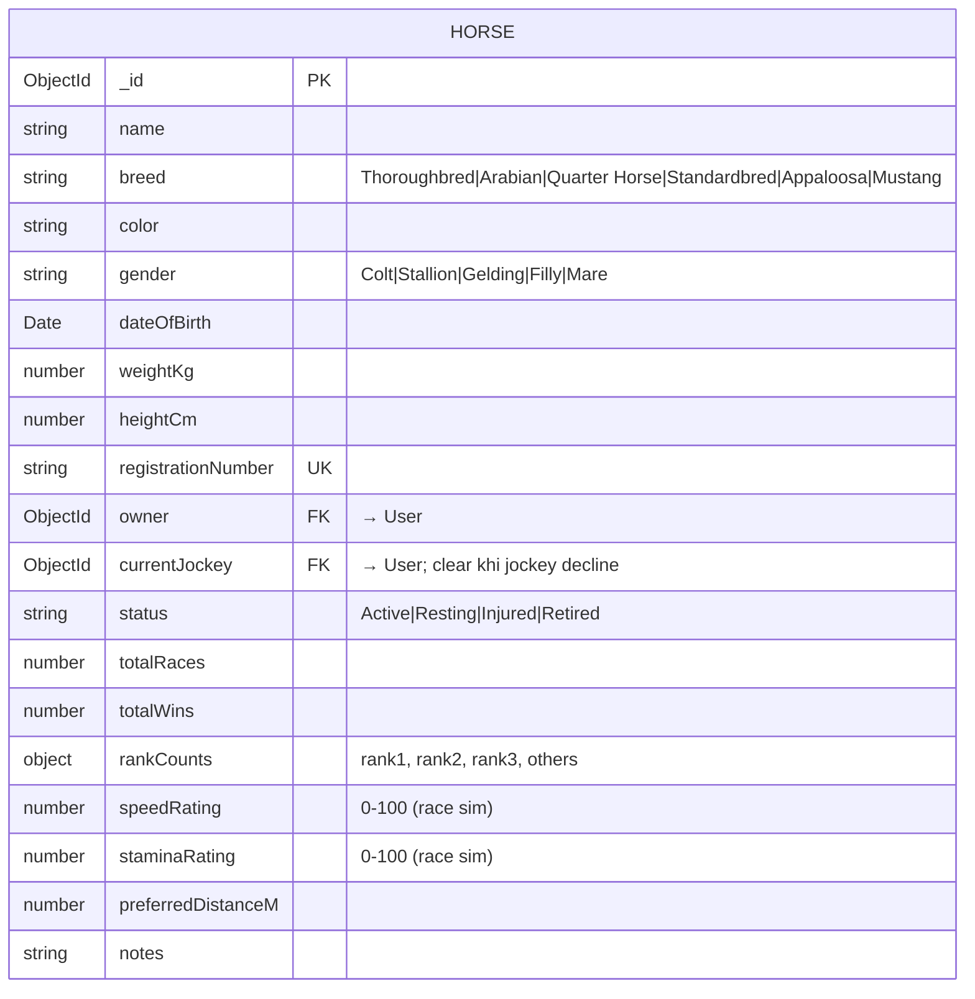
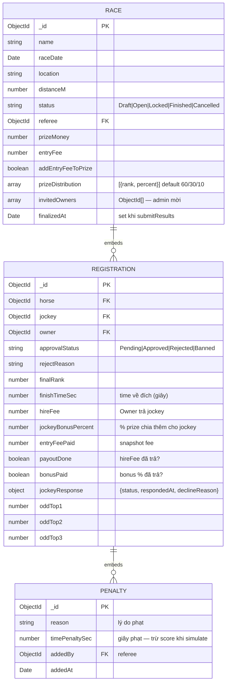
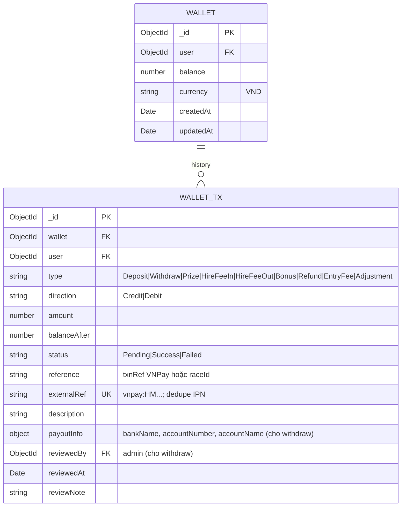
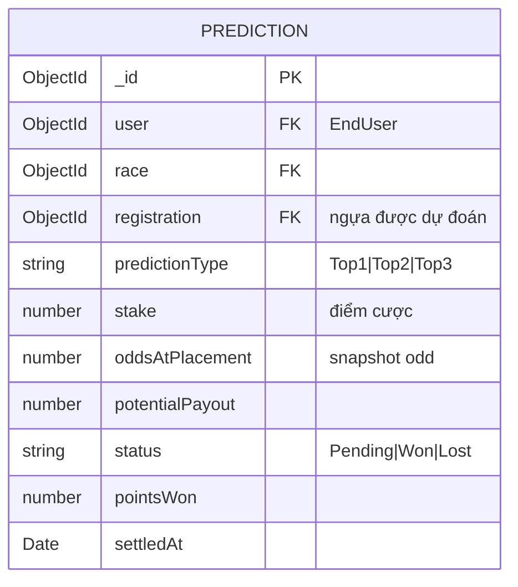
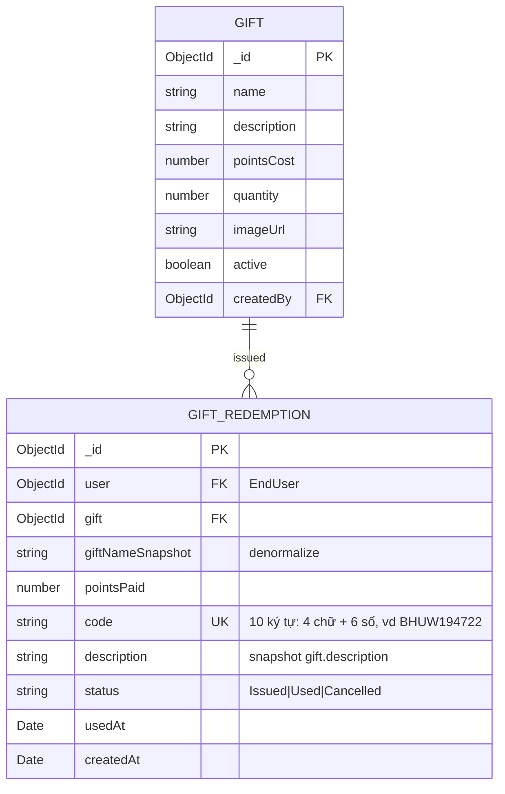
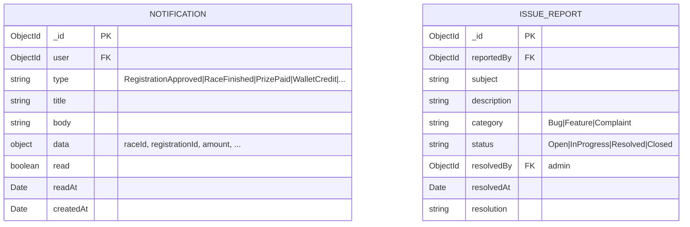

# ERD - HorseManage

Schema database MongoDB (Mongoose). User dùng discriminator pattern — 5 role chia sẻ 1 collection `users` qua field `role`.

## Sơ đồ tổng quan

---

## User (base + 5 discriminators)

---

## Horse

---

## Race + Registration (embedded)

---

## Wallet + Transaction

---

## Prediction (EndUser bet)

---

## Gift + Voucher Code

---

## Notification + Issue

---

## Indexes quan trọng

| Collection | Index | Lý do |
|---|---|---|
| `users` | `username UK`, `email UK`, `googleId UK sparse` | Auth lookup |
| `horses` | `registrationNumber UK sparse`, `owner`, `currentJockey` | List + filter nhanh |
| `races` | `registrations.horse`, `registrations.jockey` | Tìm race của jockey/ngựa nhanh |
| `wallettransactions` | `wallet`, `user`, `externalRef` | History + dedupe IPN |
| `predictions` | `user`, `race` | EndUser xem dự đoán |
| `gifts` | (id), `active+quantity` | Atomic redeem |
| `giftredemptions` | `code UK sparse`, `user` | Tra code, lịch sử |
| `notifications` | `user` | Inbox |

---

## Cardinality summary

- 1 User → 0..1 Wallet
- 1 OwnerHorse → 0..N Horse
- 1 Horse → 0..1 currentJockey (Jockey)
- 1 Referee → 0..N Race
- 1 Race → 0..N Registration (embedded)
- 1 Registration → 0..N Penalty (embedded)
- 1 EndUser → 0..N Prediction
- 1 Gift → 0..N GiftRedemption
- 1 User → 0..N Notification
