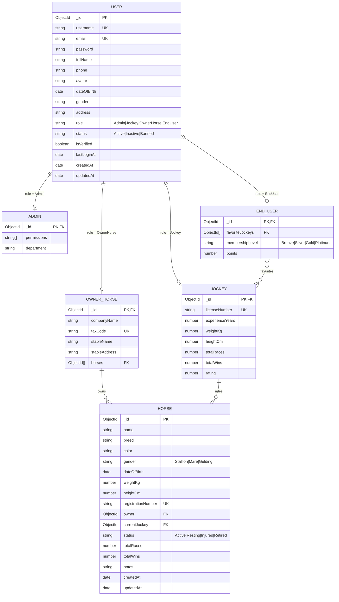

# ERD - HorseManage

## Sơ đồ thực thể



## Phân quyền (Roles)

| Role | Mô tả | Cột riêng |
|------|-------|-----------|
| **Admin** | Quản trị hệ thống | `permissions`, `department` |
| **Jockey** | Nài ngựa (người cưỡi ngựa thi đấu) | `licenseNumber`, `experienceYears`, `weightKg`, `heightCm`, `totalRaces`, `totalWins`, `rating` |
| **OwnerHorse** | Chủ ngựa / chủ chuồng | `companyName`, `taxCode`, `stableName`, `stableAddress`, `horses[]` |
| **EndUser** | Người dùng cuối (fan, khán giả) | `favoriteJockeys[]`, `membershipLevel`, `points` |

## Endpoints

| Method | URL | Mô tả | Auth |
|--------|-----|-------|------|
| POST | `/api/auth/register` | Đăng ký (truyền `role`) | ❌ |
| POST | `/api/auth/login` | Đăng nhập | ❌ |
| GET  | `/api/auth/me` | Thông tin user hiện tại | ✅ Bearer |
| GET  | `/api/admin/ping` | Test phân quyền Admin | ✅ Admin |
| GET  | `/api/jockey/ping` | Test phân quyền Jockey | ✅ Jockey |
| GET  | `/api/owner/ping` | Test phân quyền OwnerHorse | ✅ OwnerHorse |

## Ví dụ request

### Register (Jockey)
```json
POST /api/auth/register
{
  "username": "jockey01",
  "email": "jockey01@example.com",
  "password": "123456",
  "fullName": "Nguyễn Văn A",
  "role": "Jockey",
  "licenseNumber": "JK-001",
  "experienceYears": 3,
  "weightKg": 55,
  "heightCm": 165
}
```

### Login
```json
POST /api/auth/login
{
  "emailOrUsername": "jockey01@example.com",
  "password": "123456"
}
```

## Biến môi trường (.env)
```
MONGODB_URL=mongodb://localhost:27017/horsemanage
JWT_SECRET=your_secret_key
JWT_EXPIRES_IN=7d
PORT=3000
```
