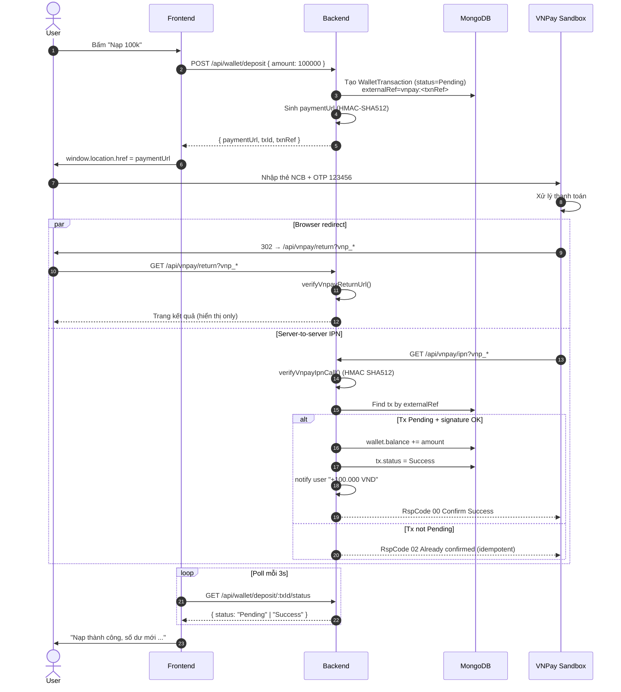
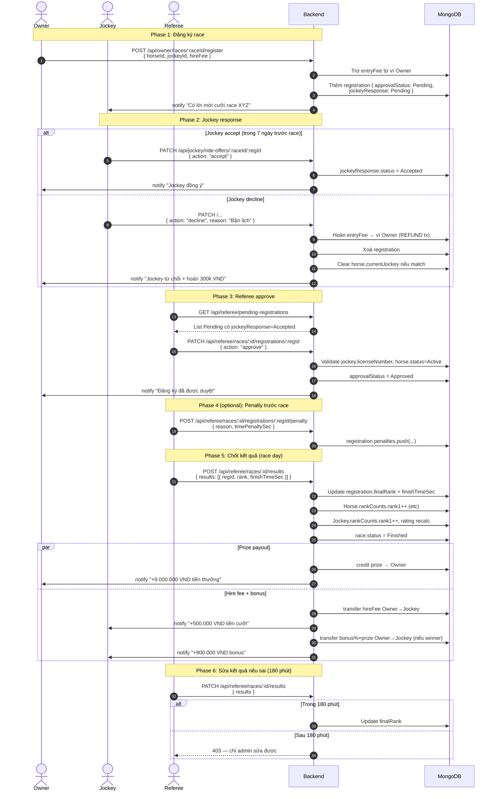
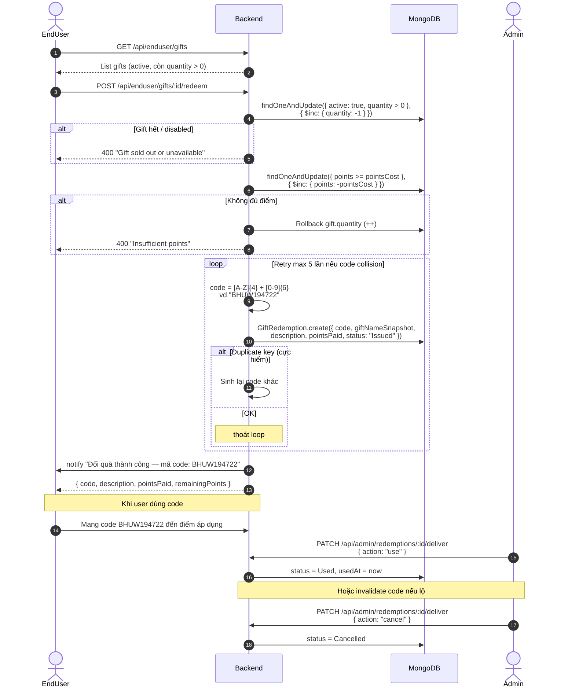
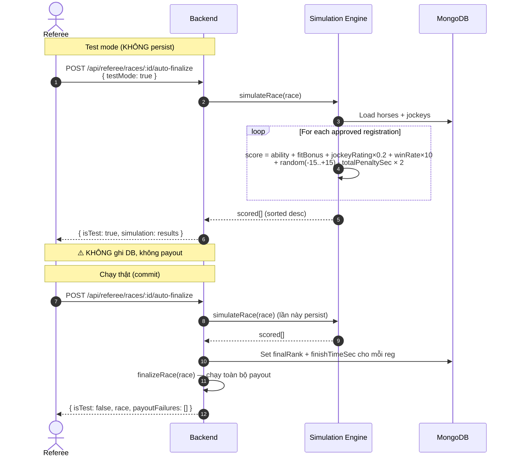
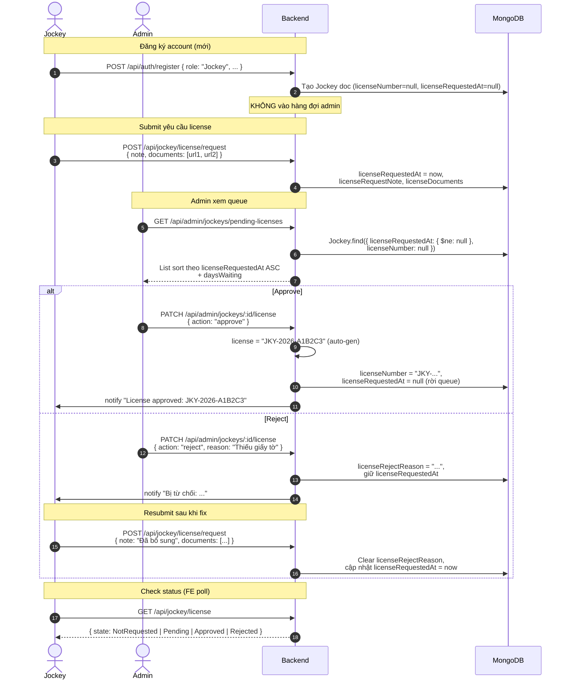

# HorseManage — Sequence Diagrams cho các flow chính

Tài liệu vẽ bằng [Mermaid](https://mermaid.live) — GitHub render trực tiếp.

---

## 1. VNPay deposit flow

User nạp tiền qua trang VNPay sandbox. IPN là nguồn tin cậy duy nhất để credit ví.

**Key design points:**
- Backend KHÔNG credit ví ngay khi user gọi `/deposit` → tránh ai cũng có thể "tạo tiền"
- IPN có signature HMAC-SHA512 → an toàn server-to-server
- Idempotent qua `externalRef` → VNPay retry không double-credit
- Tx Pending → Success update IN-PLACE (không tạo tx mới) để FE poll bằng `txId` cũ vẫn thấy

---

## 2. Race lifecycle (Owner → Jockey → Referee → Payout)

Từ lúc Owner đăng ký race đến khi nhận tiền thưởng.

**Key design points:**
- Owner trả entryFee NGAY khi đăng ký → cam kết
- Jockey decline trong deadline → tự refund + remove → owner dễ đăng ký lại
- 1 jockey không cưỡi 2 ngựa cùng race (physical constraint)
- Referee approve cần jockey.licenseNumber + horse.status=Active
- Payout (prize/hireFee/bonus) atomic qua walletService với `payoutDone`/`bonusPaid` flags
- Edit window 180 phút cân bằng giữa "fix typo" và "data integrity"

---

## 3. Gift redemption với voucher code

EndUser đổi điểm lấy code 10 ký tự thay vì vật phẩm vật chất.

**Key design points:**
- Atomic decrement gift.quantity → race condition safe
- Rollback points nếu code generation fail (cực hiếm)
- Description snapshot từ gift → user xem lại trong lịch sử dù gift bị admin sửa
- Status enum: `Issued` (vừa cấp) → `Used` (đã dùng) hoặc `Cancelled` (admin huỷ)

---

## 4. Race simulation (Konami-style)

Trọng tài có thể chạy mô phỏng để test trước khi chốt thật.

**Key design points:**
- `testMode=true` chạy hoàn toàn an toàn, response có cờ `isTest` để FE hiển thị watermark
- Sau khi test ưng ý, gọi cùng endpoint không có testMode để commit thật
- Random variance đảm bảo cùng input → output khác nhau (realism)
- Penalty từ referee TRỪ score → ngựa vi phạm dễ rớt hạng

---

## 5. Jockey license request

Jockey phải chủ động yêu cầu license, không tự động vào hàng đợi admin.

**Key design points:**
- 2-step opt-in (signup → request) → tránh spam dashboard admin
- Resubmit dùng cùng endpoint, tự clear rejectReason
- License number tự gen format `JKY-YYYY-XXXXXX`
- FE state machine 4 states để render đúng nút (Yêu cầu / Đang chờ / Active / Nộp lại)

---

## Reference

| Flow | Endpoint chính |
|---|---|
| 1. VNPay deposit | `POST /api/wallet/deposit` → `GET /api/vnpay/ipn` |
| 2. Race lifecycle | `POST /api/owner/races/:id/register` → `POST /api/referee/races/:id/results` |
| 3. Gift redemption | `POST /api/enduser/gifts/:id/redeem` |
| 4. Race simulation | `POST /api/referee/races/:id/auto-finalize` |
| 5. License request | `POST /api/jockey/license/request` → `PATCH /api/admin/jockeys/:id/license` |
